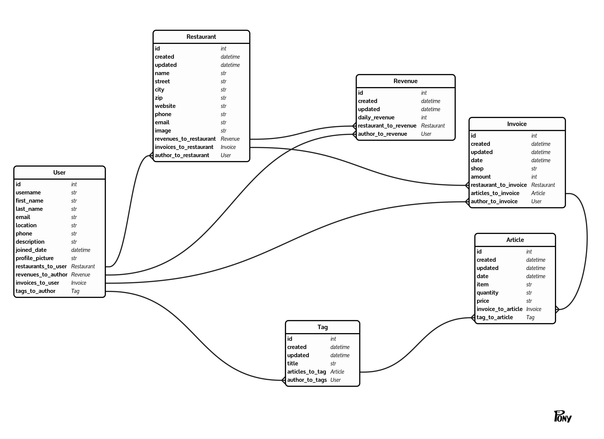

# Invoice Analyzing App

  

###  Notes

This project was done as a group assignment during the Full-Stack program at Propulsion Academy. 

### Team
[Lina Siegrist](https://www.linkedin.com/in/lina-sc/), [Markus Giger Mattmuller](https://www.linkedin.com/in/markus-giger/), [Tobias Gujer](https://www.linkedin.com/in/tobiasgujer/), [VirenThakur](https://www.linkedin.com/in/thakurviren/)

# How to run the project

### Backend:
[Link to Backend](#backend-section)

- In the root folder of the project:
    - docker-compose up
    - search for the name of the container to access it:
        - docker exec -ti 'name of the container' bash
    - inside the container:
        - python manage.py migrate
        - python manage.py makemigrations
        - python manage.py createsuperuser
        - python manage.py runserver 0.0.0.0:8000
    
- In your broswer go to : **localhost:8000/backend/admin/**

### Frontend:
[Link to Frontend](#frontend-section)

- In the folder Frontend:
    - npm install
    - npm start
    
- In your broswer go to : **localhost:3000**
  

<h1 id="frontend-section">Frontend</h1>

This project was bootstrapped with [Create React App](https://github.com/facebook/create-react-app).

## Available Scripts

In the project directory, you can run:

### `npm start`

Runs the app in the development mode. 
Open [http://localhost:3000](http://localhost:3000) to view it in the browser.

The page will reload if you make edits. 
You will also see any lint errors in the console.

### `npm test`

Launches the test runner in the interactive watch mode. 
See the section about [running tests](https://facebook.github.io/create-react-app/docs/running-tests) for more information.

### `npm run build`

Builds the app for production to the `build` folder. 
It correctly bundles React in production mode and optimizes the build for the best performance.

The build is minified and the filenames include the hashes. 
Your app is ready to be deployed!

See the section about [deployment](https://facebook.github.io/create-react-app/docs/deployment) for more information.

### `npm run eject`

**Note: this is a one-way operation. Once you `eject`, you can’t go back!**

If you aren’t satisfied with the build tool and configuration choices, you can `eject` at any time. This command will remove the single build dependency from your project.

Instead, it will copy all the configuration files and the transitive dependencies (webpack, Babel, ESLint, etc) right into your project so you have full control over them. All of the commands except `eject` will still work, but they will point to the copied scripts so you can tweak them. At this point you’re on your own.

You don’t have to ever use `eject`. The curated feature set is suitable for small and middle deployments, and you shouldn’t feel obligated to use this feature. However we understand that this tool wouldn’t be useful if you couldn’t customize it when you are ready for it.

## Learn More

You can learn more in the [Create React App documentation](https://facebook.github.io/create-react-app/docs/getting-started).

To learn React, check out the [React documentation](https://reactjs.org/).

### Code Splitting

This section has moved here: https://facebook.github.io/create-react-app/docs/code-splitting

### Analyzing the Bundle Size

This section has moved here: https://facebook.github.io/create-react-app/docs/analyzing-the-bundle-size

### Making a Progressive Web App

This section has moved here: https://facebook.github.io/create-react-app/docs/making-a-progressive-web-app

### Advanced Configuration

This section has moved here: https://facebook.github.io/create-react-app/docs/advanced-configuration

### Deployment

This section has moved here: https://facebook.github.io/create-react-app/docs/deployment

### `npm run build` fails to minify

This section has moved here: https://facebook.github.io/create-react-app/docs/troubleshooting#npm-run-build-fails-to-minify
  

<h1 id="backend-section">Backend</h1>

## REST API Backend Endpoints
All the following endpoints should be prefixed with /backend

#### Registration
* `/api/registration/` POST: Register new user by asking for email (a validation code will be sent to given email)
* `/api/registration/validate/` POST: Validate the creation of a new user with the code sent by email
* `/api/auth/token/` POST: Get a new JWT by passing username and password
* `/api/auth/token/refresh/` POST: Get a new JWT by passing an old still valid refresh token
* `/api/auth/token/verify/` POST: Verify a token by passing the access token
* `/api/auth/password-reset/` POST: Reset users password by sending a validation code in a email.
* `/api/auth/password-reset/validate/` POST: Validate password reset token and set new password for the user

#### Users
* `/api/users/me/` GET: Get the profile of logged in user
* `/api/users/me/` PATCH: Update the profile of logged in user
* `/api/users/list/` GET: Get all users
* `/api/users/list/<int:id>/` GET: Get a user by id

#### Restaurants
* `/api/restaurants/` GET: Get the list of all the restaurants
* `/api/restaurants/new/` POST: Create a new restaurant
* `/api/restaurants/me/` GET: Get the info of the restaurant of the logged in user
* `/api/restaurants/<int:id>/` GET: Get the details of a restaurant by providing the id of the restaurant
* `/api/restaurants/<int:id>/` PATCH: Update a restaurant by id (only by owner or restaurant admin). 
* `/api/restaurants/<int:id>/` DELETE: Delete a restaurant by id (only by owner or restaurant admin). 
* `/api/restaurants/search/?search=<str:search_string>` POST: Get the invoices with the search_string (shop of invoice, item of article)

#### Invoices
* `/api/invoices/` GET: Get the list of all the invoices
* `/api/invoices/new/` POST: Create a new invoice
* `/api/ invoices /<int:id>/` GET: Get the details of an invoice by providing the id of the invoice
* `/api/ invoices /<int:id>/` PATCH: Update an invoice by id (only by author)
* `/api/ invoices /<int:id>/` DELETE: Delete a invoice by id (only by author)
* `/api/invoices/date/start_date/end_date/` GET: Get the list of invoices in a specific period
* `/api/invoices/highest/<int:number>/` GET: Get the list of invoices with the highest total_amount with the given number
* `/api/invoices/latest/<int:number>/` GET: Get the list of the latest invoices with the given number

#### Articles
* `/api/articles/` GET: Get the list of all articles.
* `/api/articles/new/` POST: Create new article for a invoice
* `/api/article/tag/<int:tag_id>/` GET: Get the list of articles in a specific tag
* `/api/articles/<int:article_id>/` GET: Get a specific article by ID and display all the information
* `/api/articles/<int:article_id>/` PATCH: Update a specific article (only by author)
* `/api/articles/<int:article_id>/` DELETE: Delete a specific article (only by author)
* `/api/invoices/tag/<int:tag_id>/`  GET: Get the list of articles with a specific tag
* `/api/articles/date/start_date/end_date/tag/` GET: Get the list of articles in a specific period
* `/api/invoices/date/start_date/end_date/tag/<int:tag_id>/` GET: Get the list of invoices in a period with a specific tag

#### Revenues
* `/api/revenues/` GET: Get the list of all the revenues
* `/api/revenues/new/` POST: Create a new revenue
* `/api/revenues /<int:revenues_id>/` GET: Get a specific revenue by ID and display all the information
* `/api/revenues /<int:revenues_id>/` PATCH: Update a specific revenue (only by author)
* `/api/revenues /<int:revenues_id>/` DELETE: Delete a specific revenue (only by author)
* `/api/revenues /date/<int:start_date>/<int:end_date>/` GET: Get the list of revenues in a specific period 

#### Tags
* `/api/tags/` GET: Get the list of all the tags
* `/api/tags/new/` POST: Create a new tag
* `/api/tags/<int:tag_id>/` GET: Get a specific tag by ID and display all the information
* `/api/tags/<int:tag_id>/` PATCH: Update a specific tag (only by author)
* `/api/ tags/<int:tag_id>/` DELETE: Delete a specific tag (only by author)

### Entity Relationship Diagram - created on https://editor.ponyorm.com/

